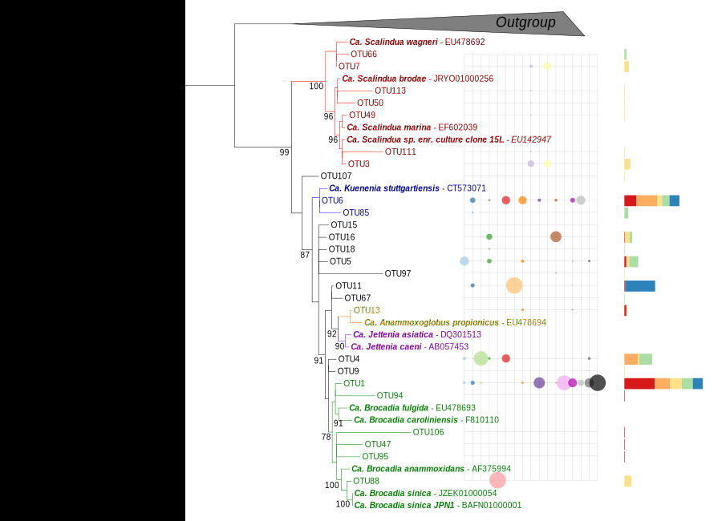

# anammox-soil-tree

This github repository details the phylogenetic analyses carried out in the paper **Environmental factors determining distribution and activity of anammox bacteria in minerotrophic fen soils** written by Alexandre Bagnoud, Sylvia Guye-Humbert, Brigitte Schloter-Hai, Michael Schloter and Jakob Zopfi and published in FEMS Microbiology Ecology, Volume 96, Issue 2 in February 2020 ([https://doi.org/10.1093/femsec/fiz191](https://doi.org/10.1093/femsec/fiz191)).

Two phylogenetic analyses are reported here:
1) The first one concerns only [anammox sequences retrieved from this study](#1-phylogenetic-analysis-of-anammox-sequences-retrieved-from-this-study). As it was performed in 2008, a combination of cloning and Sanger sequencing were used, only a limited number of sequences were obtained.

2) The second analysis is similar, but uses as input [all anammox sequences retrieved from public database and that originate from terrestrial environments](#2-phylogenetic-analysis-of-anammox-sequences-retrieved-from-all-studies-of-terrestrial-environments). As the number of analysed sequences is more important, this analysis is a bit more complex.

Note: the statistical analyses of this article are presented in another [repository](https://github.com/alex-bagnoud/AnammoxBellefontaine).

### 1) Phylogenetic analysis of anammox sequences retrieved from this study

This first part consist of placing the anammox sequences retrieved from 4 samples orignating from two soils, on a reference tree. Sequences were obtained by cloning the amplicon of a nested PCR. The first PCR amplification was carried out with Pla46f ([Neef *et al.* 1998](https://www.ncbi.nlm.nih.gov/pubmed/9884217)) and Univ1390r ([Zheng *et al.* 1996](https://www.ncbi.nlm.nih.gov/pubmed/8953722)) primers, and the second amplification (after a 100x dilution of the first PCR product) with Amx368f and Amx890r primers ([Schmid *et al.* 2005](https://www.ncbi.nlm.nih.gov/pmc/articles/PMC1082507/)). Then, amplicons were inserted into plasmids and introduced in electrocompetant *E. Coli*. After clones isolation, primer insert were amplified by PCR, and compared by their restricution profiles produced by *AluI* and *MspI*. Clones yiedling indentical restriction profiles were considered as indentical, and one clone of each group was sent out for Sanger sequencing.

This approach lacks of specificity, has about 10% of the sequences were not affiliated to anammox bacteria. Those were excluded from the subsequent analysis.

This first part was entirely carried out with online tools:
- mafft v.7 (http://mafft.cbrc.jp/alignment/server/)
- BMGE v.1.12 (https://galaxy.pasteur.fr/)
- IQ-TREE v.1.5.3 (http://iqtree.cibiv.univie.ac.at/)
- iTOL (https://itol.embl.de/)

#### 1.1) Reference alignement

Firt, a reference alignment was carried out with the default parameters of mafft v.7 (http://mafft.cbrc.jp/alignment/server/). The reference sequences were retrieved from Silva database (https://www.arb-silva.de/) by selecting only 16S rRNA sequences from the 12 anammox candidate species. Two non-anammox sequences were added to the alignment (*Pseudomonas aeruginosa* PACS2 and *Gemmata obscuriglobus* UQM 2246).

The fasta file of the unaligned sequences can be accessed [here](0-input_files/1-ref_tree_seq.fasta), and the alignement produced by mafft [here](1-BF_amx_tree/1-ref_set_aligned_mafft.fasta).

#### 1.2) Add short sequences to the reference alignement

Then, the short anammox sequences retrieved from this study were added to the reference alignment, by using the default parameters of the "--addfragments" option of mafft v.7. The file [0-input_files/1-ref_tree_seq.fasta](0-input_files/1-ref_tree_seq.fasta) was used as alignement file, and the file [0-input_files/2-bf_amx_seq.fasta](0-input_files/2-bf_amx_seq.fasta) was used as fragment file.

The new alignement was saved as [1-BF_amx_tree/2-mafft_addfragments_alignment.fasta](1-BF_amx_tree/2-mafft_addfragments_alignment.fasta).

#### 1.3) Alignment parsing
The alignment was then parsed using BMGE v.1.12 (https://galaxy.pasteur.fr/) in order to remove regions with too high entropy and with poor phylogenetically information. The default parameters were used.

The parsed alignement was saved as [1-BF_amx_tree/3-bmge_parsed_alignment.fasta](1-BF_amx_tree/3-bmge_parsed_alignment.fasta).

#### 1.4) Tree construction

The tree was computed with IQ-TREE v.1.5.3 (http://iqtree.cibiv.univie.ac.at/) using the default parameters. IQ-TREE is a fast and effective stochastic algorithm to infer phylogenetic trees by maximum likelihood. 

All the outputs generated by IQ-TREE were saved in [1-BF_amx_tree/4-iqtree/](1-BF_amx_tree/4-iqtree/).

#### 1.5) Manual tree annotation

Finally, the tree was annotated with iTOL (https://itol.embl.de/) and with Inkscape (https://inkscape.org). Labels were added to iTOL using [1-BF_amx_tree/5-itol/1-itol_tree_labels.txt](1-BF_amx_tree/5-itol/1-itol_tree_labels.txt) as annotation file. An interactive version of this tree can be accessed here: https://itol.embl.de/tree/13113072109170871488992480.

Here is the final version of the tree:


### 2) Phylogenetic analysis of anammox sequences retrieved from all studies of terrestrial environments

The second part of this script describes a phylogenetic meta-analysis of all 16S rRNA sequences of anammox retrieved from other studies of terrestrial environments.

Even though this second part shares many tools with the first one, most of the steps were computed locally using bash or R commands. Here is the list of softwares (and databases) that need to be installed locally in order to run this script:
- AliView (https://ormbunkar.se/aliview/)
- BLAST(https://blast.ncbi.nlm.nih.gov/Blast.cgi?CMD=Web&PAGE_TYPE=BlastDocs&DOC_TYPE=Download)
- USEARCH (https://www.drive5.com/usearch/)
- QIIME (http://qiime.org/)
- Silva database for QIIME (https://www.arb-silva.de/download/archive/qiime/)
- The "Biostrings" package for R (https://bioconductor.org/packages/release/bioc/html/Biostrings.html)
- RAxML (https://cme.h-its.org/exelixis/web/software/raxml/)

#### 2.1) Input sequences

All anammox sequences were downloaded using the accession numbers found in literature. They have been pooled in this file: [0-input_files/3-soils_seq.fasta](0-input_files/3-soils_seq.fasta)

Then, sequences headers were parsed in order to include the study references (in bash):
 ```{bash}
less 0-input_files/3-soils_seq.fasta | \
sed -e "s/>GU08/>Zhu_2011 GU08/g" | \
sed -e "s/>HQ63/>Hu_2011 HQ63/g" | \
sed -e "s/>FM17/>Humbert1 FM17/g" | \
sed -e "s/>FN90/>Humbert2 FN90/g" | \
sed -e "s/>GQ42/>Dong_2010 GQ42/g" | \
sed -e "s/>JF96/>Wang_2013 JF96/g" | \
sed -e "s/>JN17/>Hu_2013 JN17/g" | \
sed -e "s/>AB60/>Sato_2012 JN17/g" | \
sed -e "s/>KT16/>Shen_2016 KT16/g" | \
sed -e "s/>KM88/>Shen_2015 KM88/g" | \
sed -e "s/>KJ50/>Yang_2015 KJ50/g" | \
sed -e "s/>KF75/>Shen_2014 KF75/g" | \
sed -e "s/>KF28/>Han_2013 KF28/g" | \
sed -e "s/>JQ91/>Shen_2013 JQ91/g" | \
sed -e "s/>HQ65/>Sher_2012 HQ65/g" | \
sed -e "s/>KJ70/>Naeher_2015 KJ70/g" | \
sed -e "s/>KT87/>Bagnoud KT87/g" > 2-amx_soil_seq/1-soils_seq_new_labels.fasta
```

This fasta file was then made "flat" (in bash)

```{bash}
less 2-amx_soil_seq/1-soils_seq_new_labels.fasta | awk -v RS='>'     -v FS="\n"     \
-v OFS=""     -v ORS="" '{ if (NR > 1) { printf ">%s\n",$1; $1=""; printf "%s\n",$0 } }' \
> 2-amx_soil_seq/2-soils_seq_new_labels_flat.fasta
```

Finally, Bagnoud's and Humbert's reads were relabeled to specify the soil type in the sequence header (in bash). This was only done for these studies, as they are the only ones that looked at different soil types.

```{bash}
while read p; do
	if [[ $p == *'Bagnoud'* ]] && [[ $p == *'clone 3'* ]]; then
		echo $p | awk '{gsub("Bagnoud","Bagnoud_soil3")}1';
	elif [[ $p == *'Bagnoud'* ]] && [[ $p == *'clone 2'* ]]; then
		echo $p | awk '{gsub("Bagnoud","Bagnoud_soil2")}1';
	elif [[ $p == *'Humbert1'* ]] && [[ $p == *'clone CdvP'* ]]; then
		echo $p | awk '{gsub("Humbert1","Humbert1_CdV")}1';
	elif [[ $p == *'Humbert1'* ]] && [[ $p == *'clone Cad'* ]]; then
		echo $p | awk '{gsub("Humbert1","Humbert1_Cad")}1';
	elif [[ $p == *'Humbert1'* ]] && [[ $p == *'clone Ln'* ]]; then
		echo $p | awk '{gsub("Humbert1","Humbert1_LN")}1';
	elif [[ $p == *'Humbert1'* ]] && [[ $p == *'clone Gc'* ]]; then
		echo $p | awk '{gsub("Humbert1","Humbert1_GC")}1';
	elif [[ $p == *'Humbert1'* ]] && [[ $p == *'clone Wa'* ]]; then
		echo $p | awk '{gsub("Humbert1","Humbert1_VS")}1';
	elif [[ $p == *'Humbert1'* ]] && [[ $p == *'clone Ca'* ]] && ! [[ $p == *'clone Cad'* ]]; then
		echo $p | awk '{gsub("Humbert1","Humbert1_Cam")}1';
	elif [[ $p == *'Humbert1'* ]] && [[ $p == *'clone EC'* ]]; then
		echo $p | awk '{gsub("Humbert1","Humbert1_enrich")}1';
	elif [[ $p == *'Humbert1'* ]] && [[ $p == *'clone Bo'* ]]; then
		echo $p | awk '{gsub("Humbert1","Humbert1_Bo")}1';
	elif [[ $p == *'Humbert1'* ]] && [[ $p == *'clone Ll'* ]]; then
		echo $p | awk '{gsub("Humbert1","Humbert1_LL")}1';
	elif [[ $p == *'Humbert2'* ]] && [[ $p == *'isolate F'* ]]; then
		echo $p | awk '{gsub("Humbert2","Humbert2_soil3")}1';
	elif [[ $p == *'Humbert2'* ]] && [[ $p == *'isolate R'* ]]; then
		echo $p | awk '{gsub("Humbert2","Humbert2_LL")}1';
	else
		echo $p;	
	fi;
done < 2-amx_soil_seq/2-soils_seq_new_labels_flat.fasta > 2-amx_soil_seq/3-soils_seq_new_labels_flat_new_labels.fasta
```
#### 2.2) Reference tree

A reference tree was constructed. The mafft alignement of the 14 references sequences (12 anammox candidate species and 2 other sequences as outgroup) from the first part of the script ([1-BF_amx_tree/1-ref_set_aligned_mafft.fasta](1-BF_amx_tree/1-ref_set_aligned_mafft.fasta)) was used as starting material here.

First, the alignement was parsed with BMGE v.1.12 on https://galaxy.pasteur.fr/ using the default parameter, except that the maximum entropy threshold was set to ```1.0```, and that the minmum block size was set to ```1```. The output was saved as [3-ref_tree/4-ref_set_alignment_parsed_bmge.fasta](3-ref_tree/4-ref_set_alignment_parsed_bmge.fasta)

Then, the parsed alignement was trimmed with Aliview v.1.18 (https://ormbunkar.se/aliview/). Only positions between 10 and 1493 bp were kept. The output was saved as [3-ref_tree/5-ref_set_alignment_trimmed_aliview.fasta](3-ref_tree/5-ref_set_alignment_trimmed_aliview.fasta)

Finally, the tree was computed with IQ-TREE v.1.5.3 (http://iqtree.cibiv.univie.ac.at/) using the default parameters. The output files were [3-ref_tree/6-iqtree/](3-ref_tree/6-iqtree/)

#### 2.3) Pairwise alignment of anammox soil sequences

In this part, all the retrieved 16S rRNA anammox sequences were checked for their directionnality (to make sure that all have the same direction. Then, anammox sequences from Bellefontaine (so from this study) were blast using all other sequences as database, in order to see how similar they are to anammox sequences from other terrestrial environment. All this part was done in bash.

```{bash}
mkdir 4-blastn
```
Anammox sequences were aligned to the reference alignment to make sure that they have the same direction:

```{bash}
mafft --adjustdirection --addfragments 2-amx_soil_seq/3-soils_seq_new_labels_flat_new_labels.fasta 3-ref_tree/5-ref_set_alignment_trimmed_aliview.fasta > 4-blastn/1-amx_seq_added_refalignment_mafft.fasta
```

The aligned fasta file was made "flat":

```{bash}
less 4-blastn/1-amx_seq_added_refalignment_mafft.fasta | awk -v RS='>'     -v FS="\n"     \
-v OFS=""     -v ORS="" '{ if (NR > 1) { printf ">%s\n",$1; $1=""; printf "%s\n",$0 } }' \
> 4-blastn/2-amx_seq_added_refalignment_mafft_flat.fasta
```

The gaps (```-```) were removed from the alignment file (as we just aligned sequences to orientate them correctly):

```{bash}
while read p; do
	if [[ $p == *'>'* ]]; then
		echo $p;
	else
		echo $p | sed 's/\-//g' | sed 's/a/A/g' | sed 's/c/C/g' | sed 's/g/G/g' | sed 's/t/T/g';
	fi;
done < 4-blastn/2-amx_seq_added_refalignment_mafft_flat.fasta | grep -A1 -E "Uncultured|Humbert1" | grep -v "\-\-" | sed 's/ /_/g' > 4-blastn/3-amx_seq_good_direction.fasta
```

A blast database was created from all anammox sequences retrieved from terrestrial environments:

```{bash}
makeblastdb -in 0-input_files/2-soils_seq.fasta -dbtype nucl -out 2-blastn/4-amx_soil_db
```

Then, only sequences from this study were isolated from orientation-corrected fasta file:

```{bash}
grep -A1 "^>Bagnoud" 4-blastn/3-amx_seq_good_direction.fasta | grep -v "\-\-" > 4-blastn/5-Bagnoud_seq.fasta
```

Finally, anammox sequences from this study were blast on all the others:

```{bash}
blastn -query 4-blastn/5-Bagnoud_seq.fasta -db 2-blastn/4-amx_soil_db -out 4-blastn/6-blast_report.txt -outfmt 6
```

#### 2.4) Grouping soil anammox sequences into 97% OTUs

Here USEARCH (https://www.drive5.com/usearch/) is used to group anammox sequences in operational taxonomic units (OTU), defined based on a similarity threshold of 97%. All this part was done in bash (unless specified otherwise).

```{bash}
mkdir 5-soils_otus
```
Sequences were first dereplicated:

```{bash}
usearch -fastx_uniques 4-blastn/3-amx_seq_good_direction.fasta -fastaout 5-soils_otus/1-uniques.fasta -sizeout -relabel Uniq -tabbedout 5-soils_otus/1-uniques_report.txt
```

Sequences are clustered into OTUs with a similarity threshold of 97%:
```{bash}
usearch -cluster_otus 5-soils_otus/1-uniques.fasta -otus 5-soils_otus/2-otus97.fasta -minsize 1 -strand plus -relabel OTU -uparseout 5-soils_otus/2-otus97_report.txt
```

An OTU table was then built:
```{bash}
usearch -usearch_global 2-amx_soil_seq/3-soils_seq_new_labels_flat_new_labels.fasta -db 5-soils_otus/2-otus97.fasta -strand both -id 0.97 -otutabout 5-soils_otus/3-97otu_table.txt -uc 5-soils_otus/3-97otu_table_report.txt
```

Taxonomy was assigned with [QIIME v.1.9.1](http://qiime.org/) (UCLUST method, and SILVA128 as database):
```{bash}
source activate qiime1
assign_taxonomy.py -i 5-soils_otus/2-otus97.fasta -r databases/SILVA_128_QIIME_release/rep_set/rep_set_16S_only/97/97_otus_16S.fasta  -t databases/SILVA_128_QIIME_release/taxonomy/16S_only/97/majority_taxonomy_7_levels.txt  -o 5-soils_otus/4-silva_tax
source deactivate
```

Finally, the taxonomic annotation was added to the sequences header in the fasta file and only Brocadiaceae-annotated OTUs were selected. This was done with this R script:
```{R}
# Set variables
fasta_input <- "5-soils_otus/2-otus97.fasta"
tax_input <- "5-soils_otus/4-silva_tax/2-otus97_tax_assignments.txt"

# tax_input must be a tab-separated file with no header, with OTUs labels in the first column, and tax info in the second
fasta_output <- "5-soils_otus/5-brocadiceae_otus.fasta"
tax_criterion <- "Brocadiaceae"

# Import the asta file as data frame
library("Biostrings")

fastaToDf <- function(fastaFile){
    dnaSeq <- readBStringSet(fastaFile)
    fasta_df <- data.frame(header = names(dnaSeq), sequence = paste(dnaSeq))
}

fasta_df <- fastaToDf(fasta_input)

# Import the tax file as data frame
tax_df <- read.table(tax_input, header = FALSE, sep = "\t")

# Merge two the 2 dataframes
fasta_df2 <- merge(fasta_df, tax_df, by.x = "header", by.y = "V1")

fasta_df2$new_header <- paste(fasta_df2$header, fasta_df2$V2, sep = " ")

# Select sequences based on taxonomic criterion

fasta_df3 <- fasta_df2[grep(tax_criterion, fasta_df2$V2),]

# Save the data frame as a fasta file

dfToFasta <- function(header, seq, file){
    sequence = BStringSet(seq)
    names(sequence) <- header
    writeXStringSet(sequence, file)
}

dfToFasta(fasta_df3$new_header, fasta_df3$sequence, fasta_output)
```
#### 2.5) Evolutionnary placements of Brocadiaceae OTUs on the reference anammox tree

This last part was done with RAxML v.8.2.9 (https://cme.h-its.org/exelixis/web/software/raxml/). This algorithm can place new sequences on a reference tree, providing an alignement of the new sequences on the reference alignment (that was used to compute to reference tree).

```{bash}
mkdir 6-ep_soils_otus
```

OTUs were aligned on the reference alignement with MAFFT v.7.309 (https://mafft.cbrc.jp/alignment/software/):
```{bash}
mafft --adjustdirection --addfragments 5-soils_otus/5-brocadiceae_otus.fasta 3-ref_tree/5-ref_set_alignment_trimmed_aliview.fasta > 6-ep_soils_otus/1-broc_otus_added_refalignment_mafft.fasta
```

And here the anammox sequences were placed on the reference tree by RAxML:
```{bash}
mkdir 6-ep_soils_otus/2-epa_raxml
raxmlHPC-PTHREADS -f v -s 6-ep_soils_otus/1-broc_otus_added_refalignment_mafft.fasta -t 3-ref_tree/6-iqtree/5-ref_set_alignment_trimmed_aliview.fasta.contree -T 3 -m GTRGAMMAI -n epa_broc_otus -w 4-ep_soils_otus/2-epa_raxml/
```
#### 2.6) Tree annotation

Finally, the tree was annotated with iTOL (https://itol.embl.de). Annotations files can be accessed here [6-ep_soils_otus/3-itol/](6-ep_soils_otus/3-itol/). These files includes:
- Relabelling of the tree leaves;
- Bubbles plot for the proportions of OTUs within studies;
- Barplot for the OTUs proportion of across soil types.

The tree was edited with Inkscape (https://inkscape.org). Here is the final result:



